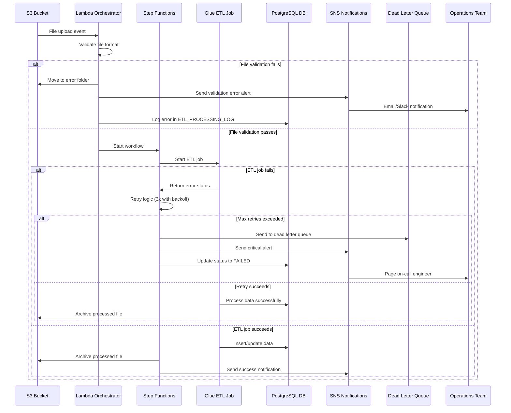
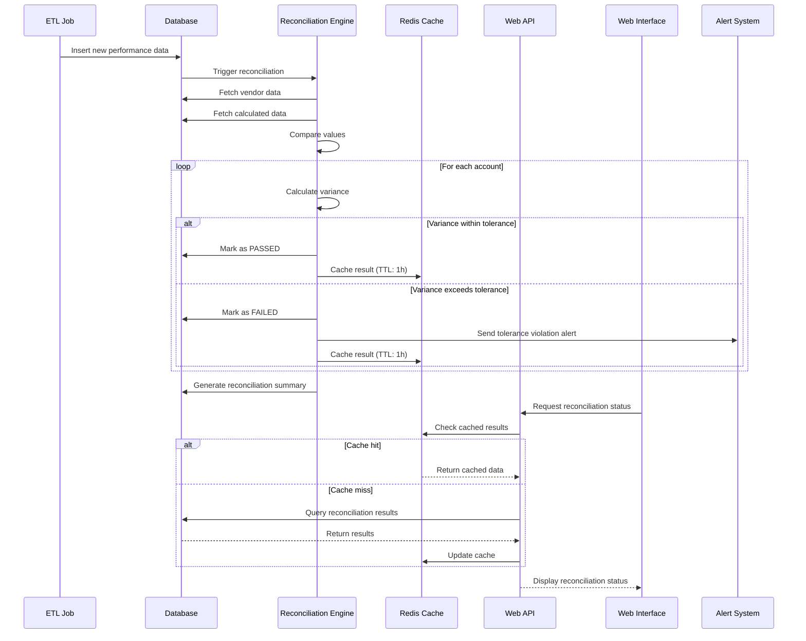
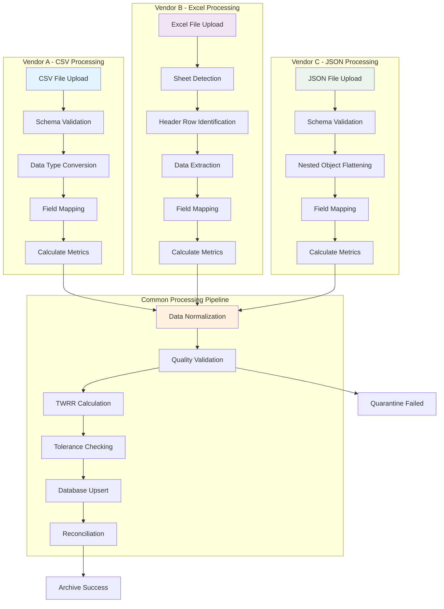
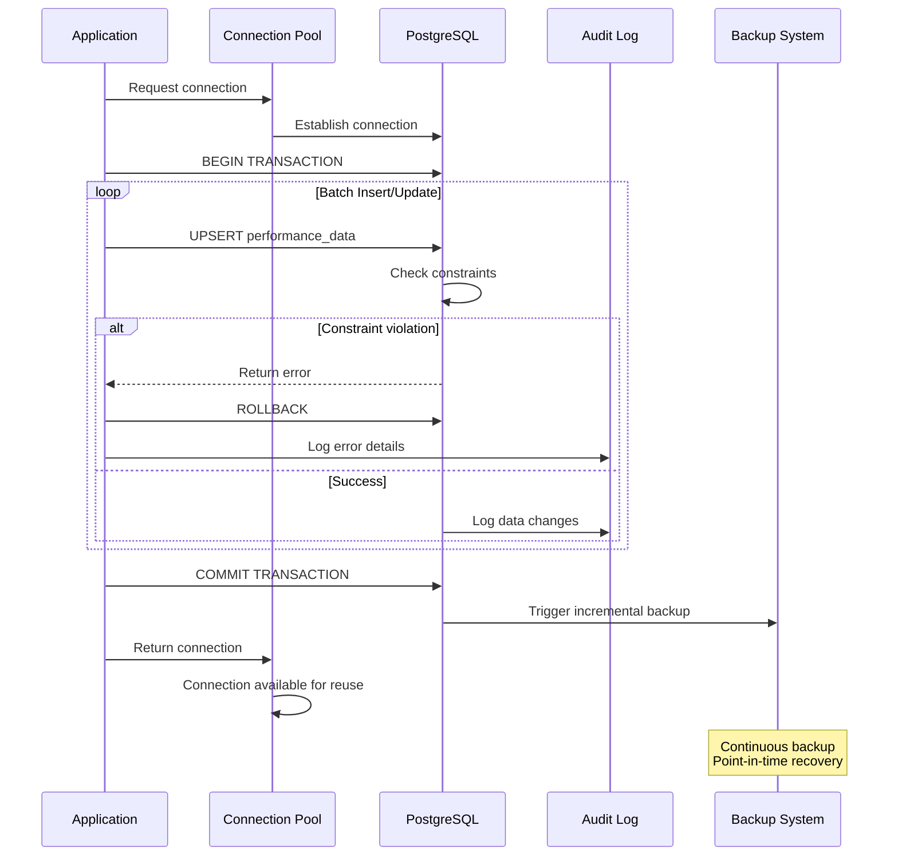
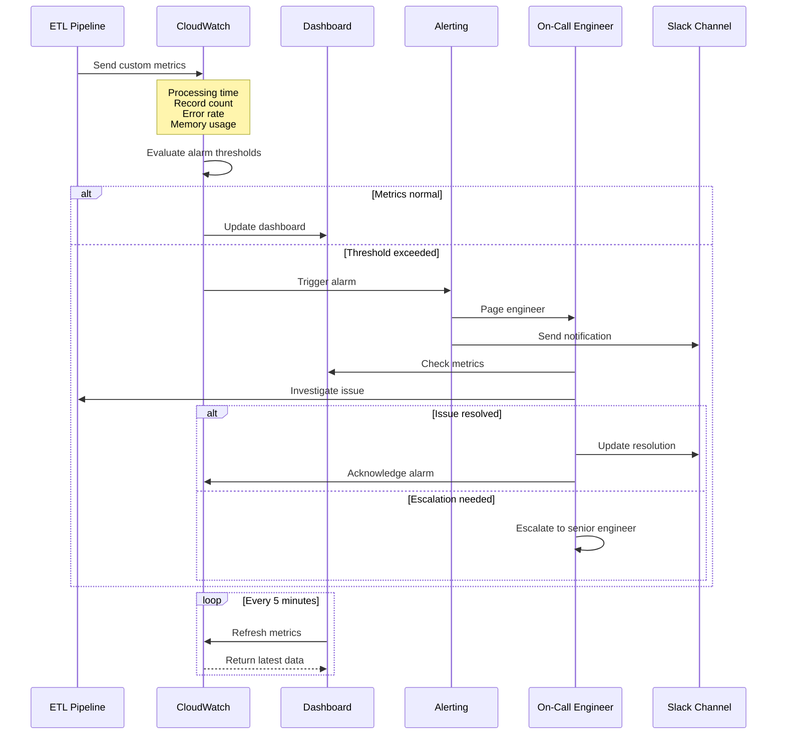
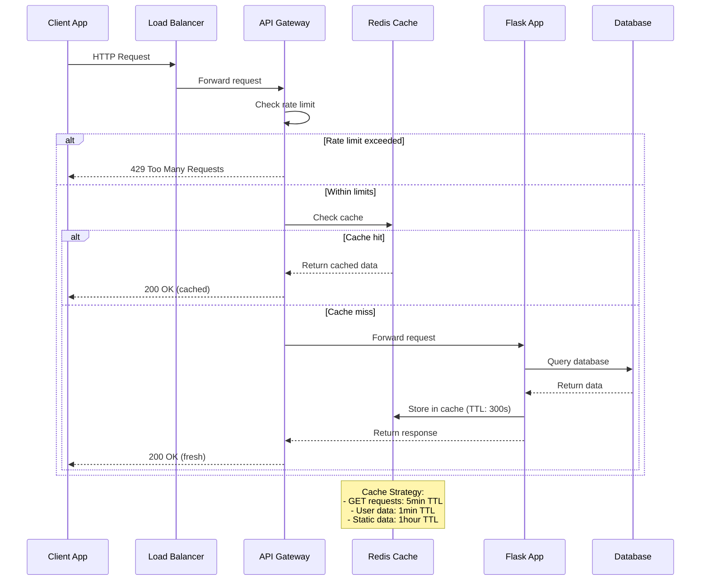
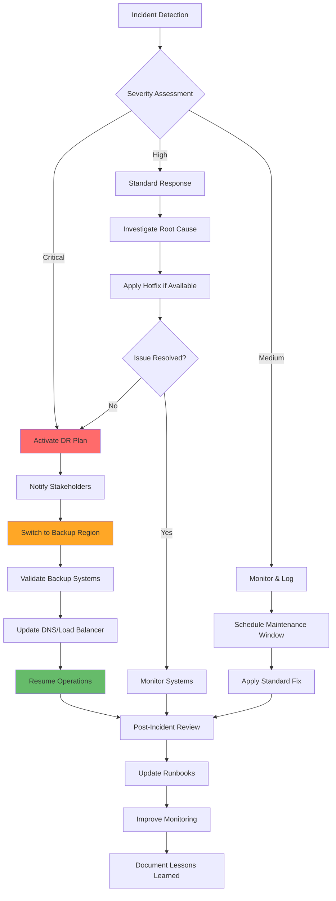
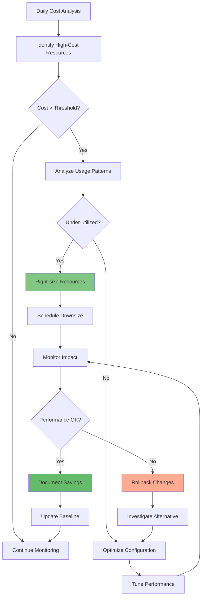

# Additional Technical Diagrams

This document contains specialized sequence diagrams and architectural views that complement the main Confluence documentation.

## Error Handling and Recovery Sequence

## Real-time Data Reconciliation Flow

## Multi-Vendor Data Processing Pipeline

## Database Transaction Flow

## Performance Monitoring Sequence

## API Rate Limiting and Caching

## Disaster Recovery Workflow

## Data Lineage and Audit Trail

```mermaid
graph LR
    subgraph "Source Systems"
        VA[Vendor A System]
        VB[Vendor B System] 
        VC[Vendor C System]
    end
    
    subgraph "Data Ingestion"
        S3RAW[S3 Raw Bucket]
        META1[Metadata Capture]
    end
    
    subgraph "Processing Layer"
        ETL[Glue ETL Job]
        CALC[Calculation Engine]
        META2[Processing Metadata]
    end
    
    subgraph "Quality Layer"
        VALID[Data Validation]
        RECON[Reconciliation]
        META3[Quality Metadata]
    end
    
    subgraph "Storage Layer"
        DB[(PostgreSQL)]
        ARCHIVE[S3 Archive]
        META4[Storage Metadata]
    end
    
    subgraph "Audit System"
        AUDIT[(Audit Database)]
        LINEAGE[Data Lineage Tracker]
    end
    
    VA --> S3RAW
    VB --> S3RAW
    VC --> S3RAW
    
    S3RAW --> META1
    META1 --> ETL
    ETL --> CALC
    CALC --> META2
    
    META2 --> VALID
    VALID --> RECON
    RECON --> META3
    
    META3 --> DB
    DB --> ARCHIVE
    ARCHIVE --> META4
    
    META1 --> AUDIT
    META2 --> AUDIT
    META3 --> AUDIT
    META4 --> AUDIT
    
    AUDIT --> LINEAGE
    
    style AUDIT fill:#e3f2fd
    style LINEAGE fill:#e8f5e8
```

## Cost Optimization Flow

---

## Diagram Legend

| Symbol | Meaning |
|--------|---------|
| 🔴 | Critical/Error state |
| 🟡 | Warning/Attention needed |
| 🟢 | Success/Normal operation |
| ⚡ | Real-time/Fast operation |
| 🔄 | Retry/Loop operation |
| 📊 | Monitoring/Metrics |
| 🔒 | Security/Authentication |
| 💾 | Data persistence |
| 🌐 | Network/API call |
| ⏰ | Scheduled/Time-based |

---

## Notes

- All sequence diagrams assume normal network conditions and service availability
- Error handling paths are simplified for clarity - actual implementation includes more detailed error scenarios
- Performance metrics and thresholds should be adjusted based on actual production requirements
- Caching TTL values are suggestions and should be optimized based on data freshness requirements
