# Advisory Performance ETL Pipeline - Project Documentation

## Table of Contents
1. [Project Overview](#project-overview)
2. [Architecture Overview](#architecture-overview)
3. [System Components](#system-components)
4. [Data Flow Architecture](#data-flow-architecture)
5. [Process Flow Diagrams](#process-flow-diagrams)
6. [Sequence Diagrams](#sequence-diagrams)
7. [Database Schema](#database-schema)
8. [API Documentation](#api-documentation)
9. [Deployment Guide](#deployment-guide)
10. [Operations & Monitoring](#operations--monitoring)
11. [Troubleshooting](#troubleshooting)

---

## Project Overview

### Business Purpose
The Advisory Performance ETL Pipeline is a serverless, cloud-native solution designed to process multi-vendor advisory performance data with high accuracy, scalability, and reliability. The system handles millions of records in production while ensuring data quality and performing complex financial calculations.

### Key Features
- **Multi-vendor data ingestion** with automatic schema detection and mapping
- **Financial calculations**: Net flow, cumulative net flow, ending market value
- **Performance metrics**: Time-weighted rate of return (TWRR), cumulative TWRR  
- **Data quality validation** and tolerance checking
- **Account reconciliation** with existing records
- **High-performance database operations** optimized for millions of records
- **Real-time monitoring** and alerting
- **Web-based UI** for data visualization and management

### Technology Stack
- **Cloud Platform**: AWS (Amazon Web Services)
- **Compute**: AWS Lambda, AWS Glue
- **Storage**: Amazon S3, Amazon RDS PostgreSQL
- **Orchestration**: AWS Step Functions
- **Monitoring**: Amazon CloudWatch
- **Frontend**: React.js with Material-UI
- **Backend**: Flask (Python)
- **Infrastructure**: AWS CDK (Infrastructure as Code)

---

## Architecture Overview

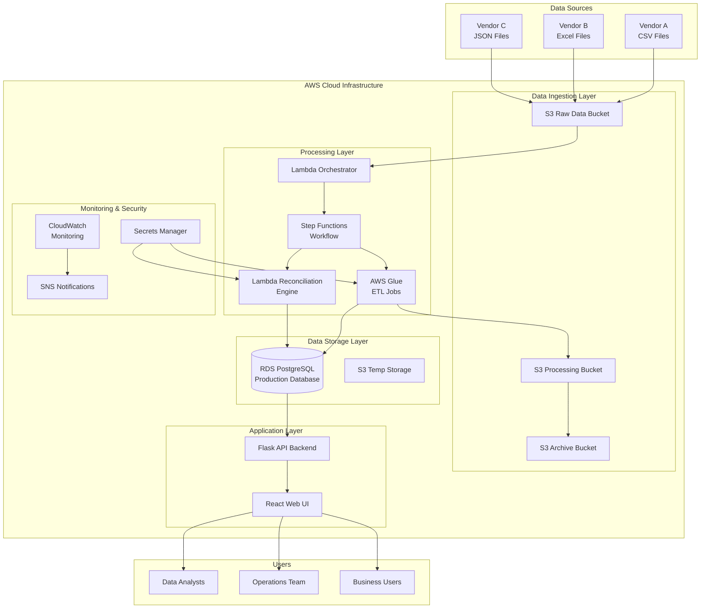

### Architecture Principles
1. **Serverless-First**: Minimize operational overhead with managed services
2. **Event-Driven**: Reactive processing based on data arrival
3. **Scalable**: Auto-scaling components handle variable workloads
4. **Resilient**: Built-in error handling and retry mechanisms
5. **Secure**: Encryption at rest/transit, least privilege access
6. **Cost-Optimized**: Pay-per-use pricing model

---

## System Components

### Core AWS Services

| Service | Purpose | Configuration |
|---------|---------|---------------|
| **AWS S3** | Data lake storage with lifecycle policies | 4 buckets: raw, processed, temp, archive |
| **AWS Lambda** | Serverless compute for orchestration | Python 3.9, 5-15 min timeout |
| **AWS Glue** | Large-scale ETL processing | Spark-based, auto-scaling |
| **AWS Step Functions** | Workflow orchestration | State machine with error handling |
| **Amazon RDS** | Production PostgreSQL database | Multi-AZ, encrypted, automated backups |
| **Amazon CloudWatch** | Monitoring and logging | Custom dashboards and alarms |
| **AWS Secrets Manager** | Credential management | Automatic rotation enabled |

### Custom Components

| Component | Technology | Purpose |
|-----------|------------|---------|
| **ETL Orchestrator** | Lambda Function | File processing initiation |
| **Reconciliation Engine** | Lambda Function | Data validation and reconciliation |
| **Performance Calculator** | Glue Job | Financial calculations (TWRR, etc.) |
| **Data Quality Checker** | Glue Job | Data validation and quality scoring |
| **Web UI** | React + Material-UI | User interface for data visualization |
| **API Backend** | Flask + SQLAlchemy | REST API for data access |

---

## Data Flow Architecture

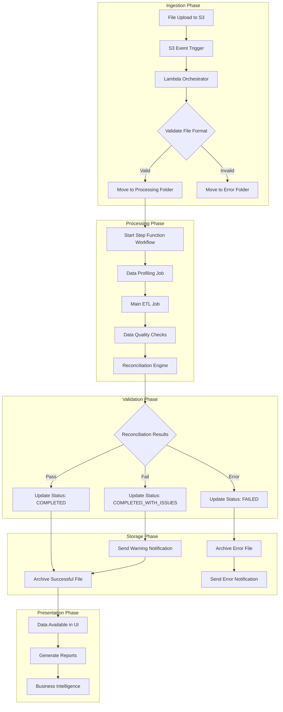

### Data Transformation Pipeline

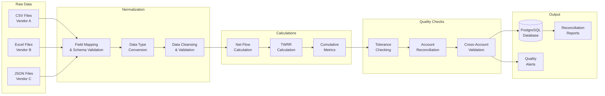

---

## Process Flow Diagrams

### 1. File Processing Workflow

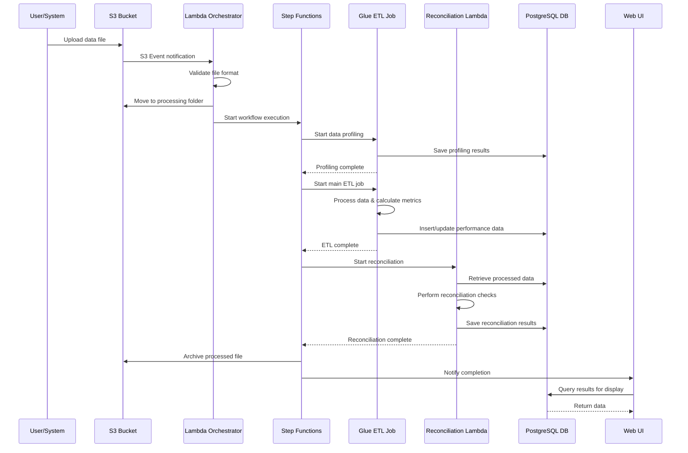

### 2. Data Quality Validation Process

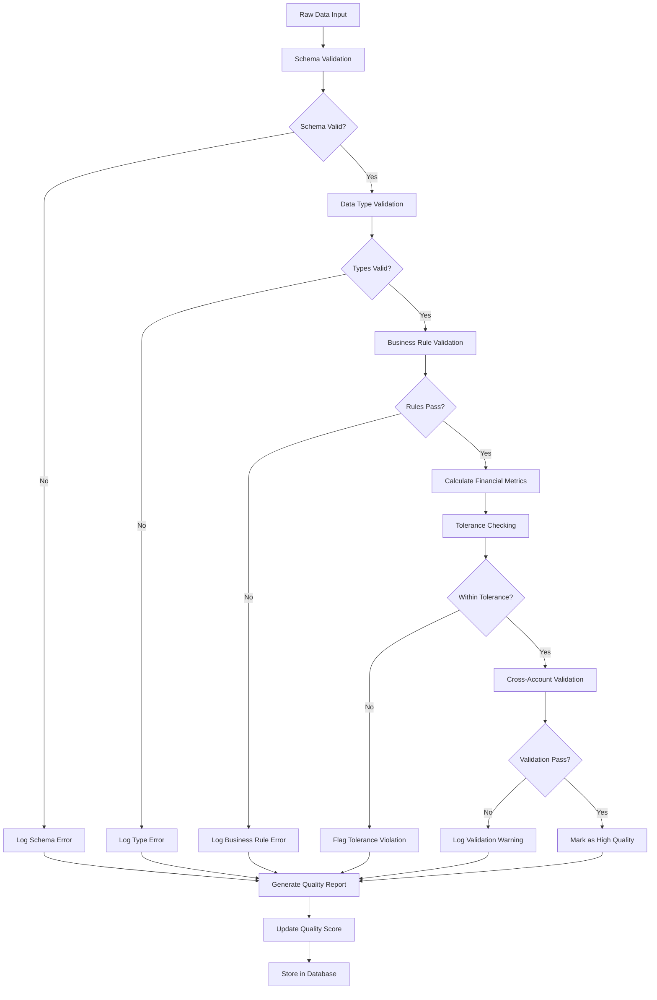

### 3. Reconciliation Process Flow

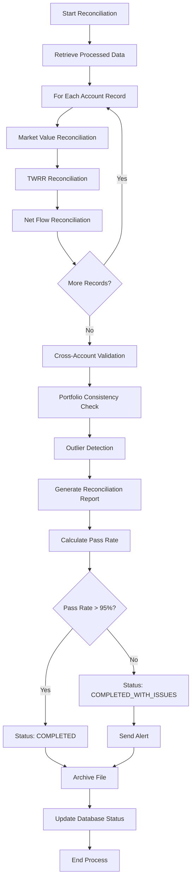

---

## Sequence Diagrams

### 1. End-to-End Processing Sequence

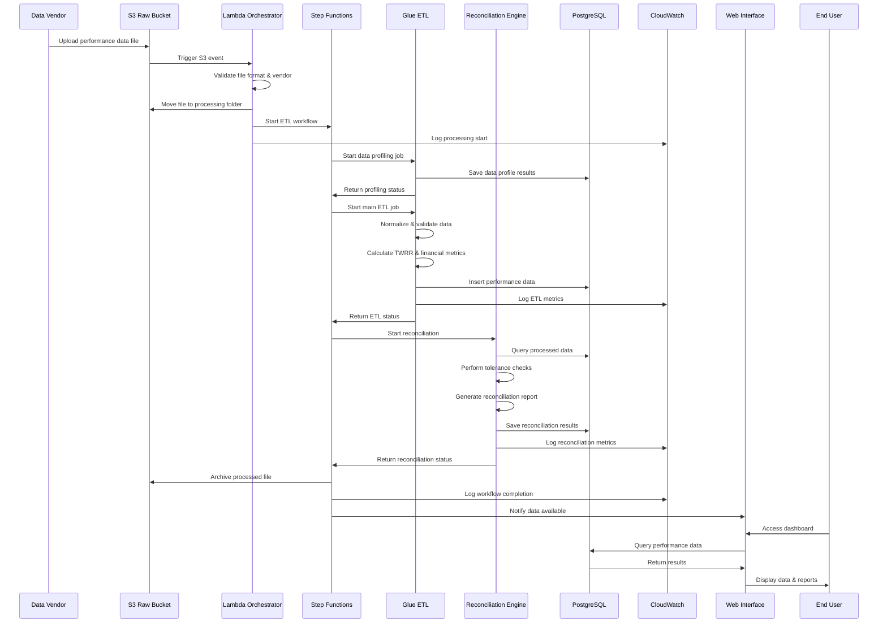

### 2. Error Handling Sequence

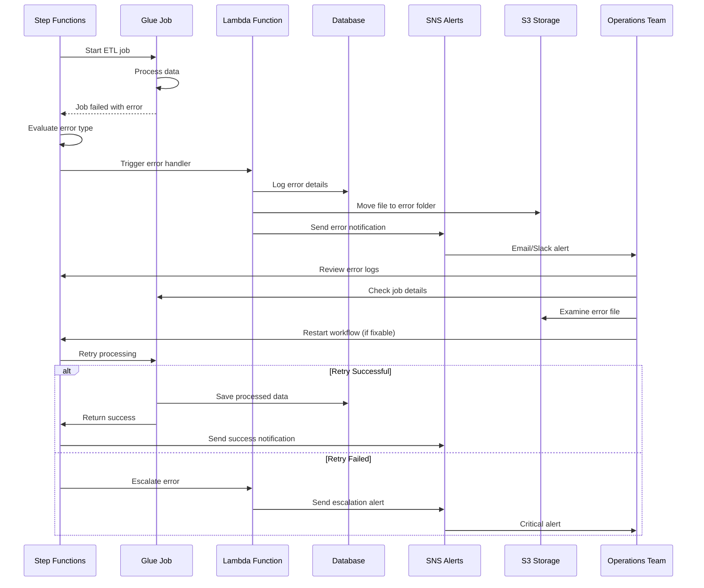

### 3. Data Quality Monitoring Sequence

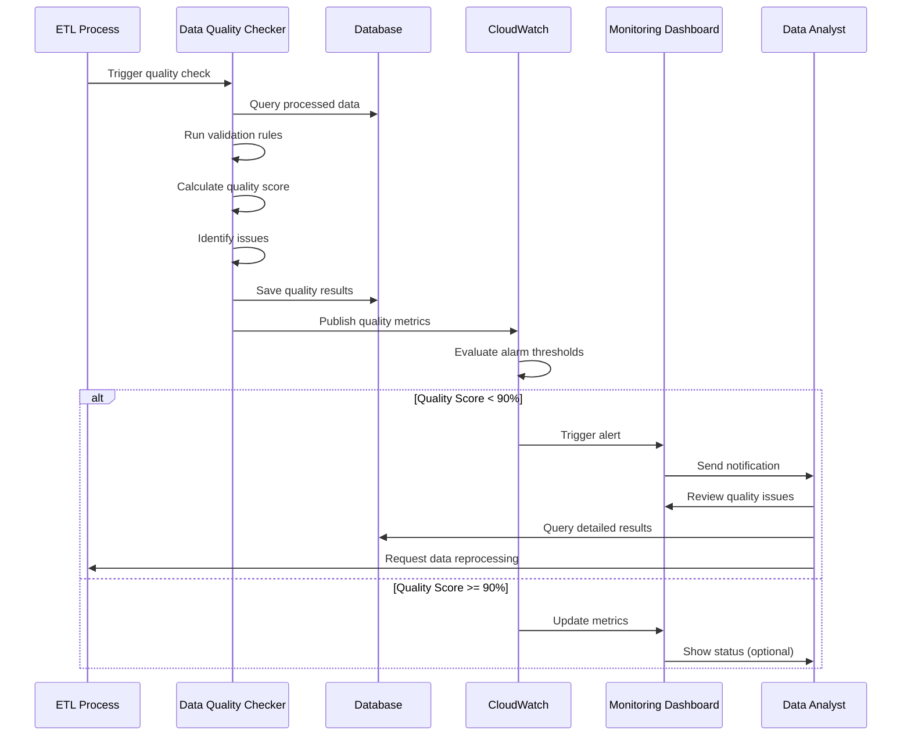

---

## Database Schema

### Entity Relationship Diagram

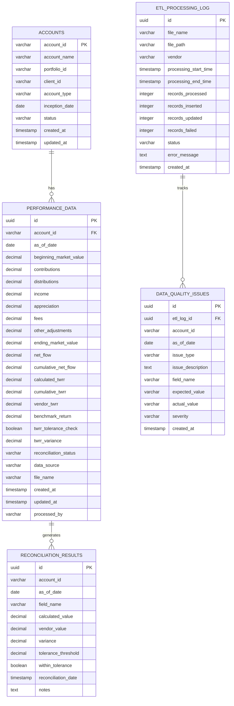

### Key Database Features

1. **Partitioning**: Performance data table partitioned by date for better query performance
2. **Indexing**: Strategic indexes on frequently queried columns
3. **Constraints**: Foreign key relationships and data validation
4. **Triggers**: Automatic calculation of derived fields
5. **Functions**: Stored procedures for complex calculations
6. **Views**: Materialized views for reporting and dashboards

---

## API Documentation

### REST API Endpoints

| Endpoint | Method | Purpose | Parameters |
|----------|--------|---------|------------|
| `/api/vendors` | GET | List all vendors | - |
| `/api/vendors/{vendor}/files` | GET | Get files for vendor | `vendor`, `status`, `date_range` |
| `/api/files/{file_id}/details` | GET | Get file processing details | `file_id` |
| `/api/files/{file_id}/data` | GET | Get processed data | `file_id`, `page`, `limit` |
| `/api/reconciliation/{file_id}` | GET | Get reconciliation results | `file_id` |
| `/api/accounts/{account_id}` | GET | Get account details | `account_id`, `date_range` |
| `/api/dashboard/summary` | GET | Get dashboard metrics | `date_range` |
| `/api/quality/score` | GET | Get data quality metrics | `vendor`, `date_range` |

### API Response Format

```json
{
  "status": "success",
  "data": {
    // Response data
  },
  "metadata": {
    "timestamp": "2025-07-08T10:30:00Z",
    "total_records": 1000,
    "page": 1,
    "per_page": 50
  },
  "message": "Request processed successfully"
}
```

---

## Deployment Guide

### Prerequisites
- AWS CLI configured with appropriate permissions
- Python 3.9+ and pip
- Node.js 16+ and npm
- Docker (for containerized deployment)

### Deployment Steps

1. **Clone Repository**
   ```bash
   git clone <repository-url>
   cd advisory-performance-etl
   ```

2. **Deploy Infrastructure**
   ```bash
   ./scripts/deploy.sh --environment production
   ```

3. **Setup Database**
   ```bash
   python scripts/setup_database.py
   ```

4. **Deploy Web Application**
   ```bash
   cd ui-application
   ./setup.sh
   docker-compose up -d
   ```

### Environment Configuration

| Environment | Purpose | Configuration |
|-------------|---------|---------------|
| **Development** | Local testing | Single instance, minimal resources |
| **Staging** | Pre-production testing | Production-like, with test data |
| **Production** | Live system | Multi-AZ, auto-scaling, monitoring |

---

## Operations & Monitoring

### Key Performance Indicators

| Metric | Target | Threshold |
|--------|--------|-----------|
| Pipeline Success Rate | >99% | Alert if <95% |
| Data Quality Score | >95% | Alert if <90% |
| TWRR Reconciliation Pass Rate | >95% | Alert if <90% |
| Processing Latency | <2 hours | Alert if >4 hours |
| Database Query Response | <5 seconds | Alert if >10 seconds |
| System Availability | >99.9% | Alert if <99% |

### Monitoring Dashboard

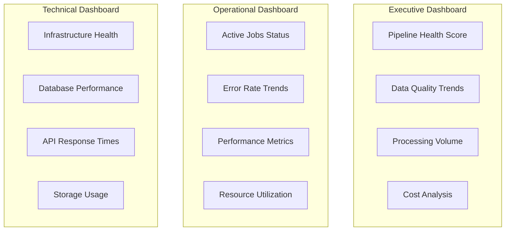

### Alerting Strategy

1. **Critical Alerts** (Immediate Response)
   - Pipeline failures
   - Data corruption
   - Security incidents

2. **Warning Alerts** (4-hour Response)
   - Performance degradation
   - Quality issues
   - Capacity concerns

3. **Informational Alerts** (Next Business Day)
   - Successful completions
   - Scheduled maintenance
   - Usage reports

---

## Troubleshooting

### Common Issues and Solutions

| Issue | Symptoms | Root Cause | Solution |
|-------|----------|------------|----------|
| **Glue Job Timeout** | Job fails after 48 hours | Large file size, insufficient resources | Increase max capacity, optimize queries |
| **Lambda Memory Error** | Function timeout, memory exceeded | Large files, complex processing | Increase memory allocation, implement streaming |
| **Database Lock** | Query timeouts, high CPU | Concurrent processing, long transactions | Optimize queries, implement connection pooling |
| **S3 Event Delay** | Processing delays | High event volume, throttling | Implement SQS buffer, batch processing |
| **Data Quality Issues** | Low reconciliation rates | Vendor data changes, mapping errors | Update vendor mappings, adjust tolerances |

### Diagnostic Commands

```bash
# Check Glue job status
aws glue get-job-runs --job-name advisory-performance-etl --max-items 5

# Review Lambda logs
aws logs filter-log-events --log-group-name /aws/lambda/advisory-etl-orchestrator --filter-pattern "ERROR"

# Check database performance
psql -h $DB_HOST -U $DB_USER -d advisory_performance -c "SELECT * FROM pg_stat_activity WHERE state = 'active';"

# Monitor S3 event processing
aws s3 ls s3://advisory-etl-raw-data/processing/ --recursive
```

---

## Change Management

### Version Control Strategy
- **Git Flow**: Feature branches, develop, main
- **Semantic Versioning**: MAJOR.MINOR.PATCH
- **Release Tags**: Annotated tags for production releases

### Deployment Pipeline
1. **Development**: Feature development and unit testing
2. **Staging**: Integration testing and performance validation
3. **Production**: Blue-green deployment with rollback capability

### Configuration Management
- Infrastructure as Code (AWS CDK)
- Environment-specific configuration files
- Secrets management via AWS Secrets Manager
- Database migrations with version control

---

## Security & Compliance

### Security Measures
- **Encryption**: At-rest (S3, RDS) and in-transit (TLS 1.2+)
- **Access Control**: IAM roles with least privilege
- **Network Security**: VPC, security groups, NACLs
- **Monitoring**: CloudTrail, GuardDuty, Config

### Compliance Requirements
- **Data Privacy**: GDPR, CCPA compliance
- **Financial Regulations**: SOX, audit trails
- **Data Retention**: Configurable retention policies
- **Access Logging**: Comprehensive audit logs

---

## Performance Optimization

### Database Optimization
```sql
-- Partition maintenance
SELECT create_monthly_partition('performance_data', '2025-08-01');

-- Index analysis
SELECT * FROM pg_stat_user_indexes WHERE idx_scan < 10;

-- Query performance
EXPLAIN ANALYZE SELECT * FROM performance_data WHERE as_of_date = '2025-07-01';
```

### ETL Optimization
- **Spark Tuning**: Adaptive query execution, partition coalescing
- **Memory Management**: Optimal driver and executor configuration
- **Parallelization**: Concurrent processing of independent tasks
- **Caching**: Strategic use of persist() for iterative operations

---

## Future Enhancements

### Roadmap Items
1. **Real-time Processing**: Stream processing for near real-time updates
2. **Machine Learning**: Anomaly detection and predictive analytics
3. **Enhanced UI**: Advanced visualization and interactive reports
4. **API Extensions**: GraphQL API, webhook notifications
5. **Multi-Region**: Disaster recovery and global deployment

### Technical Debt
- Refactor legacy data mapping logic
- Implement comprehensive integration tests
- Add performance benchmarking suite
- Enhance error handling and recovery

---

## Appendices

### A. Glossary of Terms
- **TWRR**: Time-Weighted Rate of Return
- **ETL**: Extract, Transform, Load
- **VPC**: Virtual Private Cloud
- **CDK**: Cloud Development Kit

### B. Reference Links
- [AWS Glue Documentation](https://docs.aws.amazon.com/glue/)
- [PostgreSQL Performance Tuning](https://www.postgresql.org/docs/current/performance-tips.html)
- [React Best Practices](https://reactjs.org/docs/thinking-in-react.html)

### C. Contact Information
- **Project Owner**: Data Engineering Team
- **Technical Lead**: [Your Name]
- **Support**: etl-support@company.com
- **Emergency**: #data-engineering-alerts (Slack)

---

*Document Version: 1.0*  
*Last Updated: July 8, 2025*  
*Next Review: August 8, 2025*
