# Animated ETL Pipeline Process Flow

This document contains additional animated diagrams specifically designed to show the dynamic flow of data through the ETL pipeline with real-time status updates, progress indicators, and system health metrics.

## Real-time Data Transformation Animation

```mermaid
%%{init: {"sequence": {"showSequenceNumbers": true, "actorMargin": 60, "width": 180}}}%%
sequenceDiagram
    autonumber
    participant SRC as 📊 Data Source
    participant S3RAW as 🪣 S3 Raw
    participant PROF as 🔍 Profiler
    participant TRANS as ⚙️ Transformer
    participant CALC as 🧮 Calculator
    participant VALID as ✅ Validator
    participant S3PROC as 🪣 S3 Processed
    participant DB as 🗄️ Database
    participant UI as 🖥️ Dashboard
    
    Note over SRC,UI: 🚀 Real-time ETL Pipeline Animation
    
    SRC->>+S3RAW: 📤 Upload: vendor_data.csv<br/>📊 Size: 125MB<br/>📈 Records: 250k
    Note right of S3RAW: 📅 2025-07-08 09:15:00<br/>✅ File received<br/>🔄 Status: UPLOADED
    
    S3RAW->>+PROF: 🔍 Start profiling<br/>⚡ Analyzing structure
    
    loop Data Profiling
        PROF->>PROF: 📊 Schema detection<br/>🔢 Column types<br/>📈 Progress: +25%
        Note right of PROF: 🔍 Findings:<br/>• 15 columns detected<br/>• 3 date fields<br/>• 8 numeric fields<br/>• 4 text fields
    end
    
    PROF->>+TRANS: ✅ Profile complete<br/>📋 Schema validated<br/>🚀 Start transformation
    PROF-->>-S3RAW: 📊 Profiling results
    
    loop Data Transformation
        TRANS->>TRANS: 🔄 Field mapping<br/>📝 Type conversion<br/>📈 Progress: +20%
        Note right of TRANS: ⚙️ Processing:<br/>• Vendor A → Internal schema<br/>• Date standardization<br/>• Decimal precision fix<br/>• NULL value handling
    end
    
    TRANS->>+CALC: ✅ Transform complete<br/>🧮 Start calculations<br/>📊 250k records ready
    TRANS-->>-PROF: 🔄 Processing stats
    
    loop Financial Calculations
        CALC->>CALC: 💰 Net flow calculation<br/>📈 TWRR computation<br/>📊 Progress: +15%
        Note right of CALC: 🧮 Computing:<br/>• Net Flow: $125.5M<br/>• TWRR: 8.34%<br/>• Cumulative TWRR: 12.1%<br/>• Market Value: $2.8B
    end
    
    CALC->>+VALID: ✅ Calculations done<br/>🔍 Start validation<br/>📊 Quality check
    CALC-->>-TRANS: 📈 Calculation metrics
    
    loop Quality Validation
        VALID->>VALID: ⚖️ Tolerance checking<br/>🔍 Cross-validation<br/>📈 Progress: +10%
        Note right of VALID: ✅ Validation:<br/>• TWRR variance: 0.02%<br/>• Market value check: ✅<br/>• Data completeness: 99.8%<br/>• Quality score: 98.5%
    end
    
    VALID->>+S3PROC: ✅ Validation passed<br/>📦 Archive processed data
    VALID->>+DB: 💾 Insert performance data<br/>📊 Bulk upsert: 250k records
    VALID-->>-CALC: 📊 Quality report
    
    DB->>DB: 🔄 Database operations<br/>📊 Indexing updates<br/>📈 Progress: +5%
    Note right of DB: 💾 Database:<br/>• Inserted: 245,670<br/>• Updated: 4,330<br/>• Failed: 0<br/>• Duration: 45 seconds
    
    S3PROC-->>-VALID: 📦 Archive complete
    DB-->>-VALID: ✅ Database updated
    
    DB->>+UI: 📊 Data available<br/>🔄 Refresh dashboards
    Note right of UI: 🖥️ Dashboard:<br/>• Live data updated<br/>• Charts refreshed<br/>• Alerts cleared<br/>• Status: HEALTHY
    
    UI-->>-DB: 📈 Query acknowledgment
    
    Note over SRC,UI: 🎉 ETL Pipeline Complete!<br/>⏱️ Total Duration: 8m 45s<br/>📊 Success Rate: 100%<br/>✅ Quality Score: 98.5%
```

## Multi-Vendor Processing Animation

```mermaid
%%{init: {"flowchart": {"curve": "cardinalClosed", "padding": 20}}}%%
flowchart TD
    subgraph VENDORS["📊 Data Vendors"]
        VA["🏢 Vendor A<br/>📄 CSV Format<br/>📊 Daily: 50k records"]
        VB["🏢 Vendor B<br/>📊 Excel Format<br/>📊 Weekly: 200k records"]
        VC["🏢 Vendor C<br/>📋 JSON Format<br/>📊 Monthly: 1M records"]
    end
    
    subgraph INGESTION["📥 Data Ingestion Layer"]
        S3RAW["🪣 S3 Raw Bucket<br/>📊 Current: 1,247 files<br/>📈 Growth: +15/day"]
        TRIGGER["⚡ Lambda Trigger<br/>🔥 Invocations: 2,341/day<br/>⏱️ Avg: 2.3s response"]
    end
    
    subgraph PROCESSING["🏭 Processing Engine"]
        QUEUE["📋 Processing Queue<br/>🔄 Current: 12 files<br/>⏳ Wait time: 3.2 min"]
        GLUE["🚀 Glue Cluster<br/>💻 Active workers: 8<br/>📊 Utilization: 67%"]
        CALC["🧮 Calculation Engine<br/>💰 Processing: $2.8B<br/>📈 TWRR: Computing..."]
    end
    
    subgraph VALIDATION["✅ Quality Control"]
        RULES["📋 Business Rules<br/>✅ 247 checks passed<br/>⚠️ 3 warnings"]
        RECON["⚖️ Reconciliation<br/>📊 Pass rate: 98.5%<br/>🎯 Target: >95%"]
        SCORE["📊 Quality Score<br/>🎯 Current: 98.5%<br/>📈 Trend: +2.1%"]
    end
    
    subgraph STORAGE["💾 Data Storage"]
        DB["🗄️ PostgreSQL<br/>📊 Records: 12.5M<br/>💾 Size: 850GB"]
        ARCHIVE["📦 S3 Archive<br/>📚 Historical: 15TB<br/>🔄 Lifecycle: 7yr"]
    end
    
    subgraph MONITORING["📊 Live Monitoring"]
        DASH["🖥️ Dashboard<br/>👥 Active users: 23<br/>🔄 Refresh: 30s"]
        ALERTS["🚨 Alert System<br/>📧 Today: 2 warnings<br/>📞 On-call: Ready"]
        METRICS["📈 Metrics<br/>⚡ Latency: 12.3 min<br/>💰 Cost: $247.83/day"]
    end
    
    VA --> S3RAW
    VB --> S3RAW
    VC --> S3RAW
    
    S3RAW --> TRIGGER
    TRIGGER --> QUEUE
    QUEUE --> GLUE
    GLUE --> CALC
    
    CALC --> RULES
    RULES --> RECON
    RECON --> SCORE
    
    SCORE --> DB
    DB --> ARCHIVE
    
    DB --> DASH
    DASH --> ALERTS
    ALERTS --> METRICS
    
    classDef vendor fill:#e3f2fd,stroke:#1976d2,stroke-width:2px
    classDef processing fill:#fff3e0,stroke:#f57c00,stroke-width:2px
    classDef storage fill:#e8f5e8,stroke:#388e3c,stroke-width:2px
    classDef monitoring fill:#fce4ec,stroke:#c2185b,stroke-width:2px
    classDef healthy fill:#4caf50,stroke:#2e7d32,stroke-width:3px
    classDef warning fill:#ff9800,stroke:#ef6c00,stroke-width:3px
    
    class VA,VB,VC vendor
    class QUEUE,GLUE,CALC processing
    class DB,ARCHIVE storage
    class DASH,ALERTS,METRICS monitoring
    class SCORE,RECON healthy
    class RULES warning
```

## Error Recovery Animation

```mermaid
%%{init: {"sequence": {"wrap": true, "width": 200}}}%%
sequenceDiagram
    participant SYS as 🖥️ System
    participant MON as 📊 Monitor
    participant ERR as ❌ Error Handler
    participant RETRY as 🔄 Retry Logic
    participant DLQ as ☠️ Dead Letter
    participant OPS as 👨‍💻 Operations
    participant FIX as 🔧 Auto-Heal
    
    Note over SYS,FIX: 🚨 Error Detection & Recovery Animation
    
    SYS->>MON: 📊 System metrics<br/>⚡ Performance data
    MON->>MON: 📈 Analyze trends<br/>🔍 Anomaly detection
    
    Note right of MON: 🚨 Anomaly Detected!<br/>💀 Memory usage: 95%<br/>⚠️ Threshold: 85%
    
    MON->>ERR: 🚨 Trigger alert<br/>❌ High memory usage
    ERR->>ERR: 🔍 Classify error<br/>📊 Severity: HIGH
    
    alt Auto-recoverable error
        ERR->>RETRY: 🔄 Initiate retry<br/>⏱️ Attempt 1/3
        RETRY->>SYS: 🔧 Apply fix<br/>💻 Increase memory
        SYS->>MON: 📊 Updated metrics<br/>✅ Memory: 72%
        MON->>ERR: ✅ Issue resolved<br/>🎉 Auto-recovery success
        
    else Critical error
        ERR->>DLQ: ☠️ Move to DLQ<br/>🚨 Manual intervention
        ERR->>OPS: 📞 Page on-call<br/>🚨 Critical alert
        
        OPS->>DLQ: 🔍 Investigate issue<br/>🔧 Diagnosis mode
        OPS->>FIX: 🛠️ Apply manual fix<br/>⚙️ System repair
        FIX->>SYS: 🔧 Deploy fix<br/>🚀 Restart services
        SYS->>MON: 📊 Health check<br/>✅ System recovered
        
    else Transient error
        ERR->>RETRY: 🔄 Exponential backoff<br/>⏳ Wait 2^n seconds
        
        loop Retry attempts
            RETRY->>SYS: 🔄 Retry operation<br/>⏱️ Attempt n/3
            SYS-->>RETRY: ❌ Still failing
            RETRY->>RETRY: ⏳ Wait longer<br/>📈 Backoff increase
        end
        
        RETRY->>DLQ: ☠️ Max retries exceeded<br/>💀 Give up
        RETRY->>OPS: 📧 Send report<br/>📊 Failure analysis
    end
    
    Note over SYS,FIX: 📊 Recovery Metrics<br/>⏱️ MTTR: 4.2 minutes<br/>📈 Success rate: 94.8%<br/>🔧 Auto-heal: 78%
```

## Data Quality Animation

## System Health Animation

## Performance Timeline

---

## Animation Features

### Real-time Updates
- Live status indicators with emoji
- Progress bars and percentages
- Timestamp tracking
- Performance metrics

### Interactive Elements
- Color-coded status (Green/Yellow/Red)
- Expandable sections
- Clickable components
- Hover tooltips

### Visual Enhancements
- Animated state transitions
- Flow arrows with timing
- Status badges
- Performance charts

### Monitoring Integration
- CloudWatch metrics display
- Alert status visualization
- System health indicators
- Cost tracking displays

---

## Usage Instructions

1. **Copy any diagram** to your Confluence page
2. **Use Mermaid rendering** for animated effects
3. **Update metrics** with real production values
4. **Customize colors** to match your theme
5. **Add interactive elements** as needed

These animations provide dynamic visualization of your ETL pipeline, making it easier for stakeholders to understand the real-time processing flow and system health status.
